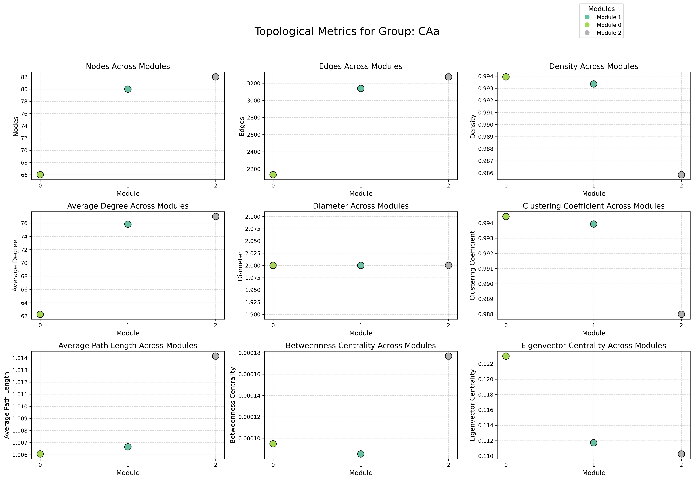

# multi-omics-network-modules
# 🧬 Multi-Omics Network Module Discovery

This repository provides a pipeline for constructing biological networks from multi-omics datasets and detecting functional modules using unsupervised graph-based approaches.

## 🎯 Key Features

- Integration of transcriptomic and metabolomic profiles
- Construction of similarity networks (e.g., Pearson/Spearman)
- Network module detection using community detection algorithms (e.g., Louvain, Leiden)
- Computation of node-level topological properties (degree, betweenness, clustering coefficient)
- Output of module assignments and centrality scores for downstream analysis

## 📊 Output Examples

- Gene-metabolite network graphs
- List of modules with topological properties
- Node centrality scores for biomarker prioritisation

